# 使用 Docusaurus + Git 优雅地搭建自己的文档和博客站点

一篇关于如何搭建 Docusaurus 的教程。使用了 Git 工具与 Nginx 中端等。

## 前言

Docusaurus 是一个现代且高效的静态网页生成器，专注于文档和博客的生成。使用 Docusaurus，站长可以不必过于关注站点的外观，而专注于内容的撰写。不论是发布产品文档、维护 Minecraft 服务器维基，还是编写个人博客，Docusaurus 都可以为我们节省很多时间，同时其简约大气的外观风格也十分贴合现代网站设计审美。

Docusaurus 的外观基于 React 框架构建，而编写内容则使用 Markdown 格式。所有内容 100% 可自定义，且支持自动目录生成、版本分离、中文搜索、翻译和 SEO 等附加功能。

在本文中，我们将在一个使用 Centos 8 Stream 的云服务器中配置 Docusaurus 的运行环境并部署 Docusaurus 服务本体。之后，我们将使用 Nginx 将我们的站点绑定到特定的子域名。最后，我们将使用 Git 工具 + GitHub 储存库管理站点，以达到文档和博客的“本地编辑、实时预览、多端同步、快速更新”的效果。

笔者用到的部分软件环境：

- Xshell 7 家庭版：SSH 工具
- Xftp 7 家庭版：FTP 工具
- Visual Studio Code：本地文本编辑器
- Windows 11：本地电脑系统
- Centos 8 Stream Server：云服务器使用的系统
- Nginx：云服务器使用的反向代理服务

## 正文

### 一 进入控制台

首先，使用 SSH 工具连接到云服务器的控制台：


（为了方便，我实际上只是在一个 VMware 中的 Centos 虚拟机上进行操作）
（对于大部分云服务器，我们都可以直接用 root 用户进行登录，自然也不用手动获取 root 权限了）

之后，使用 FTP 工具连接到云服务器，方便之后进行文件的编辑：

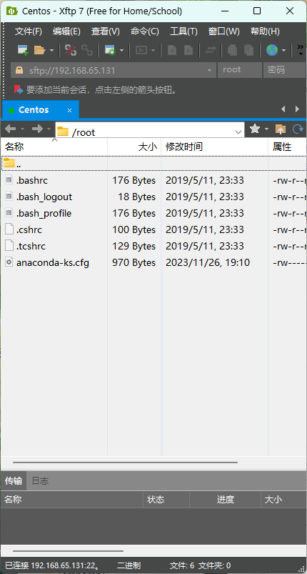

（别忘了在 Xftp 设置中配置本地文本编辑器，否则文本默认用记事本打开）

### 二 配置云服务器环境

Docusaurus 实际上是依赖于 Node.js 环境运行的一组 npm 软件包，所以我们需要先安装它们两者。

在控制台执行以下命令，安装 NodeSource 仓库：

```shell
curl -fsSL https://rpm.nodesource.com/setup_18.x | sudo bash -
```

之后等待一段时间（一开始需要等待 60 秒）。

安装完成后，使用以下命令安装 Node.js 和 npm：

```shell
yum install -y nodejs npm
```

之后，使用以下命令测试安装结果：

```shell
node -v
npm -v
```

若能看到版本号输出，则代表安装顺利完成。

若出现问题，请复制安装过程中的报错信息并在搜索引擎中寻找解决方案，抑或是询问 ChatGPT。

### 三 部署 Docusaurus

接着，我们要在自己的网站根目录中部署 Docusaurus 服务。

首先，使用以下命令创建并转到自己的网站根目录（本教程为 /var/www）:

```shell
mkdir /var/www
cd /var/www
```

接着，运行以下安装命令：

```shell
npx create-docusaurus@latest 你的站点名 classic
```

其中“你的站点名”可以替换为某个英文字符串（本文为 docusaurus）。

（安装过程中可能需要输入 y 表示同意安装）

安装完成后，网站根目录下应该出现了一个新的文件夹，名称为你刚刚设定的站点名：


其中包含 Docusaurus 的项目文件：


至此，Docusaurus 的部署实际上已经完成了。

之后，我们可以进入根目录，并通过以下命令，让 Docusaurus 帮我们生成站点的静态网页文件：

```shell
cd /var/www/docusaurus/
npm run build
```

生成完成后，我们可以看到以下文件夹，即为静态站点的根目录：

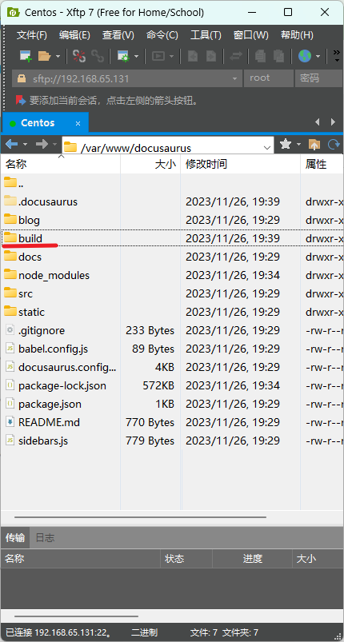

### 四 Nginx 反向代理

接下来，我们需要使用 Nginx 将站点绑定到子域名。

（注意，以下操作默认你已经购买了域名并知道如何添加 A 记录和申请免费的 SSL 证书）

首先，我们可以通过以下命令安装 Nginx：

```shell
yum install nginx
```

安装完成后，将其启动并添加到开机自启动行列：

```shell
systemctl start nginx
systemctl enable nginx
```

接着，进入 Nginx 配置文件根目录：


接着，在 conf.d 目录下新建一个站点配置文件：

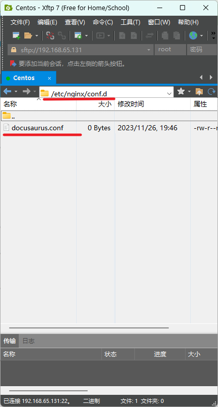

之后，在文件中添加以下内容：

```yml
# 将来自 80 端口的 http 请求重定向到 https
server {
    listen 80;
    server_name wiki.encmys.cn;
    return 301 https://$host$request_uri;
}

# https 站点配置
server {
    listen 443 ssl http2;
    server_name wiki.encmys.cn; # 你的站点域名
    ssl_certificate  /etc/nginx/wiki.encmys.cn_nginx/wiki.encmys.cn_bundle.crt; # 指定 SSL 证书文件的路径
    ssl_certificate_key /etc/nginx/wiki.encmys.cn_nginx/wiki.encmys.cn.key; # 指定 SSL 私钥文件的路径
    ssl_session_timeout 5m;
    ssl_ciphers ECDHE-RSA-AES128-GCM-SHA256:ECDHE:ECDH:AES:HIGH:!NULL:!aNULL:!MD5:!ADH:!RC4;
    ssl_protocols TLSv1.2 TLSv1.3;
    ssl_prefer_server_ciphers on;

    location / {
        root /var/www/docusaurus/build; # 你的站点 build 目录位置
        index index.html index.htm index.php;
    }
}
```

（如果获取 SSL 证书有困难，这里还有一份不使用 https 连接的配置：）

```yml
# http 站点配置
server {
    listen 80;
    server_name wiki.encmys.cn; # 你的站点域名

    location / {
        root /var/www/docusaurus/build; # 你的站点 build 目录位置
        index index.html index.htm index.php;
    }
}
```

之后，保存文件，并使用以下命令重载 Nginx 服务：

```shell
systemctl restart nginx
```

别忘了赋予 build 目录访问权限：

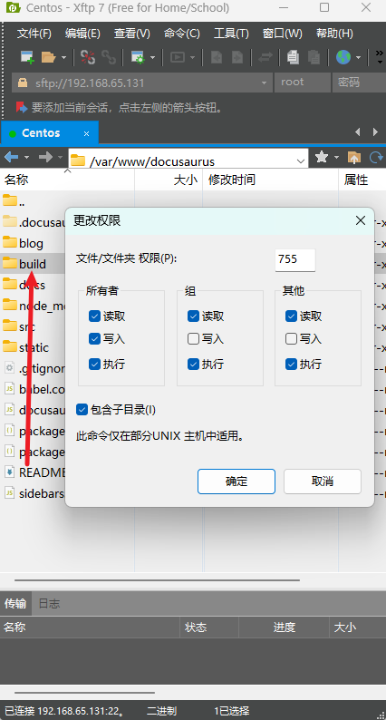

这时，你的站点应该已经可以使用域名正常访问了：


### 五 Git + GitHub 文档管理

给不了解 Git 工具的读者：Git 是一种版本控制系统，用于跟踪文件和项目在时间轴上的变化，并允许多个开发者协同工作。GitHub 则是一个基于 Git 的代码托管平台，提供了存储、管理和协作开发项目的功能。

在当前场景下，我们使用 Git 来将 Docusaurus 项目托管在 GitHub 储存库中，方便我们在本地对站点进行编辑与测试。这可以避免直接修改云服务器上的站点文件，更加安全且高效，还可以充分利用 Docusaurus 自带的支持实时更新的网页应用进行测试。

首先，前往 GitHub 新建一个储存仓库：


之后，回到控制台，使用以下命令安装 Git 工具：

```shell
yum install git
```

接着，使用以下命令初始化 Git 用户：

```shell
git config --global user.name "你的用户名"
git config --global user.email "你的邮箱"
```

（用于表示使用者的身份，不一定要与 GitHub 用户名和邮箱相同，但是推荐统一）

之后，回到 Docusaurus 根目录下初始化一个 本地 Git 仓库：

```shell
cd /var/www/docusaurus
git init
git config --global init.defaultBranch main
git branch -m main
```

（此处指定默认分支为 main 属于个人习惯，若不修改则默认分支是 master）

之后，使用以下命令将文件添加并提交到本地仓库：

```shell
git add .
git commit -m "初始提交"
```

接着，需要在服务器中配置 SSH 连接密钥并添加到 GitHub 中，从而使我们可以将服务器中的本地仓库内容推送到 GitHub 的仓库中。

首先，使用以下命令新建一个 SSH 密钥对：

```shell
ssh-keygen -t rsa
```

此命令在运行后会向用户请求三个参数，分别是密钥对的储存路径和密钥的密码。本教程采用的值如下：

```shell
Generating public/private rsa key pair.
Enter file in which to save the key (/root/.ssh/id_rsa): /root/.ssh/docusaurus
Enter passphrase (empty for no passphrase):
Enter same passphrase again:
```

即将密钥对储存在目录 /root/.ssh/ 目录下，密钥 ID 为 docusaurus，且不额外设置密码（直接按回车）。

之后，前往密钥的储存路径，打开公钥文件（.ssh 目录是一个隐藏目录，可能需要在 Xftp 设置中开启显示隐藏的文件才能看见）：


别忘了将公钥文件的权限降低：

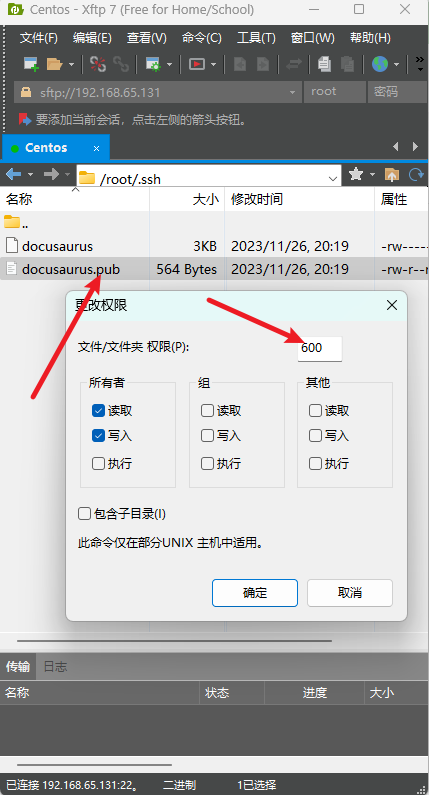

接着，复制文件中的内容并粘贴到 GitHub SSH 密钥配置中：


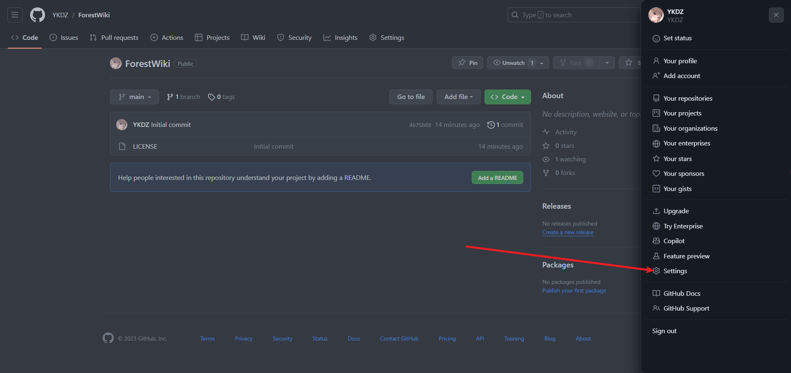

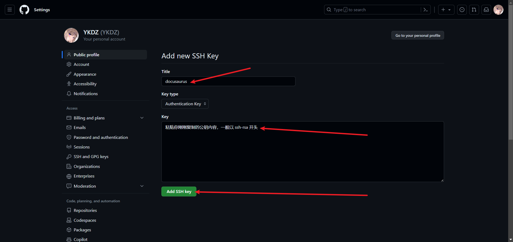

之后，回到控制台，启用 SSH 代理并添加私钥：

```shell
eval "$(ssh-agent -s)"
ssh-add /root/.ssh/docusaurus
```

接着，我们就可以配置本地 Git 仓库的远程仓库并将初始提交推送到 GitHub 了。

首先，前往 GitHub 复制远程仓库的 SSH 连接地址：

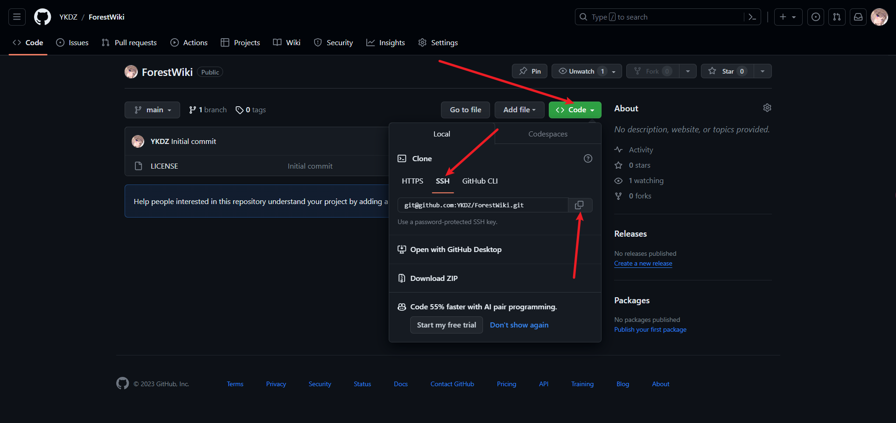

接着，使用以下命令设置远程仓库：

```shell
git remote add origin 你的 GitHub 仓库的 SSH 远程连接地址
```

之后，使用以下命令合并一次远程仓库的内容以防止冲突：

```shell
git config pull.rebase true
git pull origin main
```

最后，使用以下命令将本地仓库的内容推送到远程仓库：

```shell
git push origin main
```

现在，你应该可以在 GitHub 仓库中看到 Docusaurus 站点的内容了：


现在，我们需要在本地拉取这个仓库，这样，我们就可以在自己的主机上编辑站点的文档内容，并且使用 Docusaurus 自带的预览工具在本地预览修改后的效果，并且由 GitHub 仓库做中转站，将修改后的内容同步到服务器主机上。

首先，在电脑中安装 Git 工具。前往 Git 官网下载安装包：


并跟随提示安装 Git 工具：

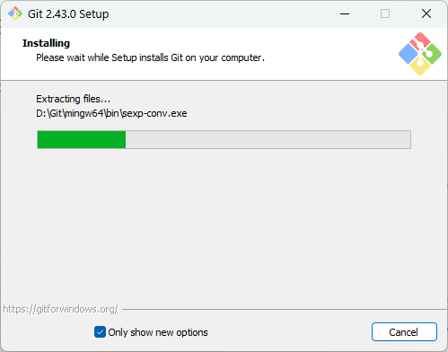

安装完毕后，打开 Git Bash 控制台：


并在其中使用以下命令克隆远程仓库：

```shell
cd d:
git clone 你的 GitHub 仓库的 SSH 远程连接地址
```

（cd 前往的目录是储存远程仓库内容的目录，这里直接放到 D 盘下）

（克隆远程仓库时可能需要为本地的新 SSH 密钥指定一个密码，跟随指引操作即可）

克隆完成后，你应该可以在指定目录下看到仓库中的内容了：

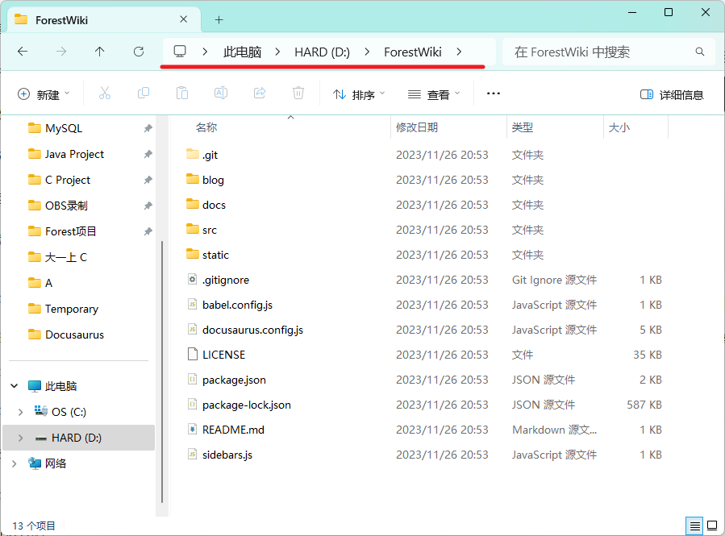

为了更方便地管理站点内容，我们使用 VSCode 打开这个目录：


并尝试修改站点的显示内容：

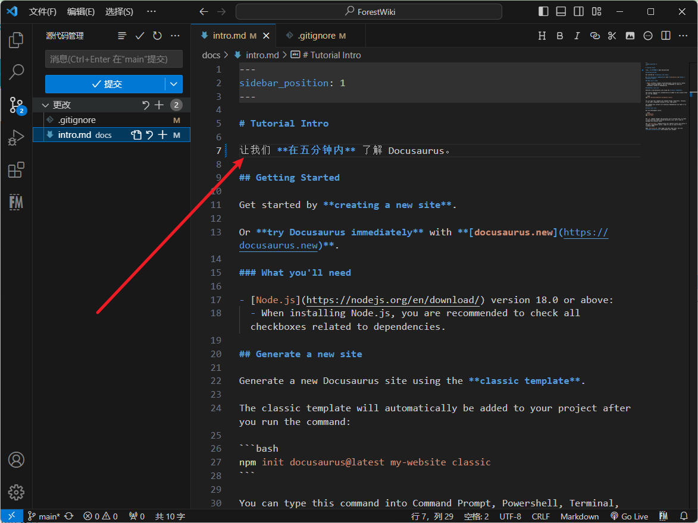

同时，因为我的 VSCode 插件 Local History 在目录内产生了备份文件，所以我还修改了 .gitignore 文件的内容，让备份文件不被同步到仓库中（因为没必要）：


若想要在本地测试修改的结果是否可以正常被解析或修改的效果是否令人满意，我们可以在本地启动测试服务器。

在本地的仓库文件夹中右键单击空白的位置，并用点击用终端打开：

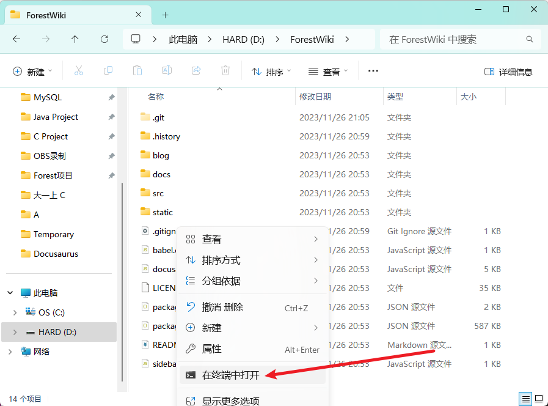

在打开的命令行中输入以下命令：

```shell
npm install
npm run start
```

这实际上在本地初始化并运行了 Docusaurus 自带的测试服务器。

执行完成后，浏览器应该被自动打开了，刚刚进行的修改也被应用了：


值得一提的是，这个本地网站是实时更新的，这意味着你的所有修改都可以直接反映在网站中，而不需要重新执行命令，比如修改主页内容：

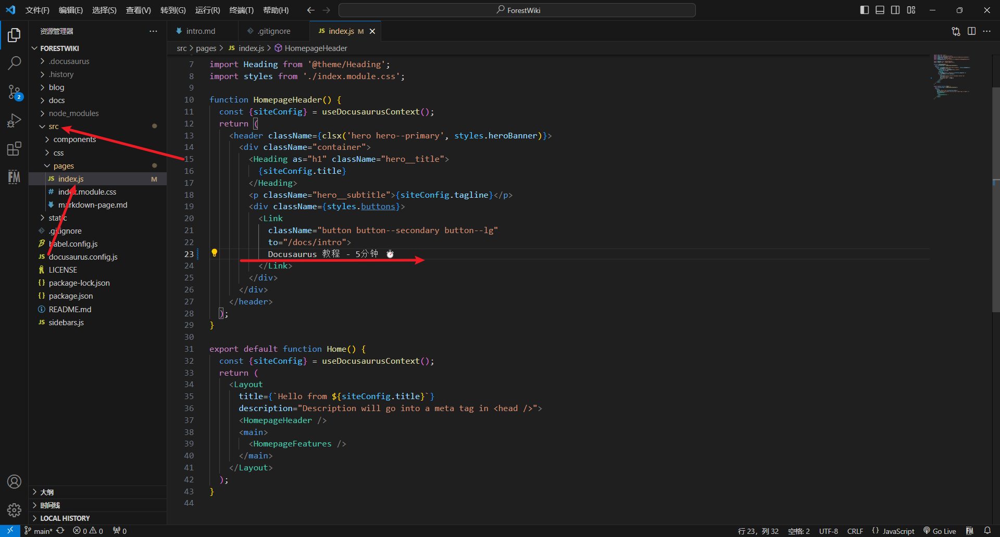

更改便直接反映在了本地站点中：


善用这个功能，可以方便且高效地自定义自己的文档站点。这也是我们费劲折腾 Git 来将站点同步到本地的主要原因。

所有对站点文件的修改完成且测试完毕后，便可以进入 VSCode 版本管理工具栏内并提交这些更改到本地仓库：

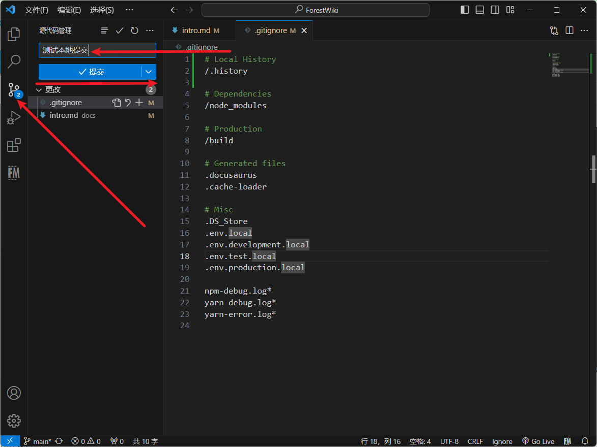

提交完成后，同步更改到远程仓库：


同步完成后，你应该可以在 Github 仓库看到刚刚的提交了：


同时远程仓库的文件内容当然也有所改变：


之后，我们可以回到服务器控制台，将刚刚的更改拉取到云服务器并应用更改。

在服务器控制台执行以下命令：

```shell
git pull origin main
```

其作用为拉取远程仓库的更改到云服务器。

接着，重新运行生成静态网页的命令：

```shell
npm run build
```

生成完成后，你应该可以在你的云服务器站点中看到你进行的更改了：


现在，我们已经完成了一个完整的更改和同步的过程。想要在多个设备上同时修改文档站点的内容，只需要在多个设备上安装 Git 工具并照常克隆、拉取和提交仓库即可。

至此，本教程的目的已经完全达成了。

### 六 一些小优化

每次在云服务器上应用提交，都需要运行两个命令，这一步骤可以被脚本简化。

在本地仓库中新建一个脚本文件，并写入一段简单的 shell 脚本：

```shell
#!/bin/bash

# 拉取远程仓库的最新内容到本地的 main 分支
git fetch origin main

# 切换到本地的 main 分支
git checkout main

# 合并远程仓库的 main 分支到本地的 main 分支
git merge origin/main

# 执行 npm run build 命令
npm run build
（作用为拉取远程仓库的内容并重新生成静态网页文件）
```

接着，将这个脚本提交并推送到远程仓库：


并在云服务器上用命令拉取远程仓库的内容：

```shell
git pull origin main
```

之后，我们 就可以通过命令运行这个脚本来更新站点的内容了：

```shell
cd /var/www/docusaurus
bash update.sh
```

## 后记

本教程到此为止，至于版本控制、博客功能、SEO、网站搜索、Markdown 语法、React 自定义样式等等的其他内容，请访问官网文档自行学习。

通过搭建这样一个简单的文档站点，我们可以学习到静态网页和 Nginx 的工作原理、Git 工具的使用和 SSH 密钥鉴权等等全方面的知识，就算没有实际需求的人，拥有搭建这样一个站点的经历应该也是不坏的。

若在安装过程中遇到了问题（肯定会遇到的吧），请先询问搜索引擎和 ChatGPT，没有找到答案或无法理解答案则欢迎发到评论区供大家讨论。

## 附录

### 常见的问题

1. 没有权限访问 GitHub 远程仓库：检查 GitHub 公钥的配置是否正确，以及控制台中是否开启了 SSH 代理。

2. 如何关闭本地的测试站点：在本地控制台中使用 Ctrl + C 快捷键。

3. 合并时发生了冲突：直接在远程仓库中编辑文件，抑或是编辑了云服务器站点内的文件并推送到远程仓库之后都有可能发生这个问题，问题的本质是文件的版本发生了混乱（若正常操作不应出现这种问题）。你需要手动处理这些冲突（编辑冲突的文件）：

```txt
<<<<<<< HEAD
内容 A（当前分支的内容）
=======
内容 B（合并的另一分支内容）
>>>>>>> feature-branch
```

（冲突的文件内容会变成以上这样，手动修改文件内容并删除这些特殊标识符即可完成冲突处理）

之后使用以下命令将处理好的文件添加到本地仓库并提交到远程仓库：

```shell
git add 发生冲突的文件的地址
git commit
git push origin main
```
（当然也可以直接在 VSCode 图形界面内进行提交和推送）

接着再正常从远程仓库拉取更改即可。

### 实用链接

- **Docusaurus 官网**：[https://docusaurus.io/](https://docusaurus.io/)
